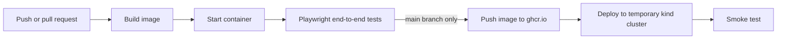

# CPM/PERT planner: containerized and delivered with CI/CD

A Flask web app for critical path (CPM) and PERT scheduling with Gantt and network diagrams. It was written as a bachelor thesis ([original repository](https://github.com/KokosovejDort/cpm-pert-app)).

This repository packages the same application with a production-style delivery setup: a container image, Docker Compose for local runs, Kubernetes manifests, and a GitHub Actions pipeline. The application code in `app/` is unchanged.

## What is included

| Path | Purpose |
|---|---|
| `Dockerfile` | Slim Python image, non-root user, gunicorn, health check |
| `docker-compose.yml` | One-command local run |
| `k8s/` | Kubernetes Deployment (2 replicas, probes, resource limits) and NodePort Service |
| `kind/kind-config.yaml` | Local cluster that exposes the Service on `localhost:8080` |
| `.github/workflows/ci.yml` | Build, test, publish and deploy pipeline |
| `requirements.txt` | Pinned runtime dependencies |
| `requirements-dev.txt` | Pinned dependencies for the end-to-end tests |
| `app/` | The application and its Playwright end-to-end tests |

## Pipeline



- **test** builds the image, starts it, and runs the Playwright test suite against the running container. It runs on every push and pull request.
- **publish** pushes the image to GitHub Container Registry, tagged with the commit SHA and `latest`. It runs only on `main`.
- **deploy-kind** pulls the published image, creates a temporary kind cluster, applies `k8s/`, waits for the rollout, and checks the health endpoint and the analysis API.

## Run it locally

Requirements: Docker with the Compose plugin. For the Kubernetes part you also need [kind](https://kind.sigs.k8s.io/) and `kubectl`.

### With Docker Compose

```bash
docker compose up --build
```

Open http://localhost:5000.

### On a local Kubernetes cluster (kind)

```bash
docker build -t cpm-pert-demo:local .
kind create cluster --name cpm-pert --config kind/kind-config.yaml
kind load docker-image cpm-pert-demo:local --name cpm-pert
kubectl apply -f k8s/
kubectl rollout status deployment/cpm-pert
kubectl get pods,svc
```

Open http://localhost:8080. To remove the cluster:

```bash
kind delete cluster --name cpm-pert
```

### Run the tests locally

The tests expect the app at `http://127.0.0.1:5000`, so start it first (for example with Docker Compose), then:

```bash
python -m venv .venv && source .venv/bin/activate
pip install -r requirements-dev.txt
python -m playwright install --with-deps chromium
pytest app/tests -q
```

## Design notes

- The Flask development server is replaced by gunicorn.
- The container runs as a non-root user (UID 10001), and the Kubernetes Deployment enforces `runAsNonRoot`, drops all capabilities, and disallows privilege escalation.
- The app's existing `/api/health` endpoint drives the Docker health check and the Kubernetes readiness and liveness probes.
- Dependencies are pinned, and dependency installation is a separate layer so rebuilds are fast.
- Tests are excluded from the image through `.dockerignore`.
- Workflow permissions follow least privilege: read-only by default, with `packages: write` only in the publish job.

## Scope

This is a demonstration setup. It uses a single-node kind cluster, a NodePort Service, and no Ingress or TLS. The app is stateless, so no persistent storage is configured.
